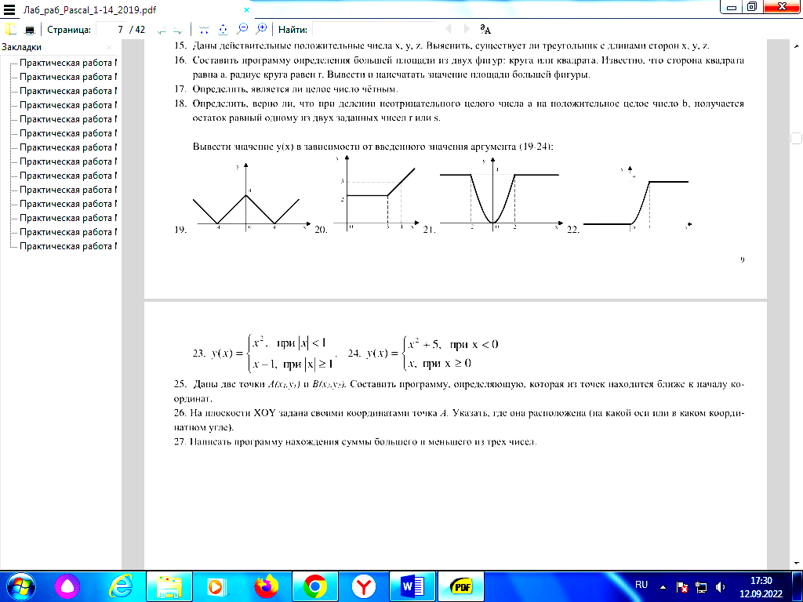
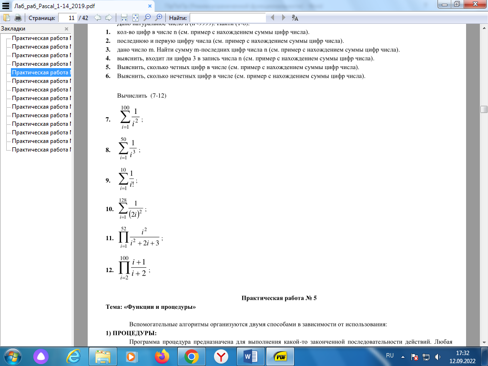

## Методические указания для обучающихся по освоению дисциплины

Практикум по программированию. Python

### Практическая работа № 1 Тема: «Простые типы данных»

### Задачи для самостоятельной работы

1. Дан радиус окружности, подсчитать длину окружности.

2. Дан радиус окружности, подсчитать площадь круга.

3. Дан произвольный треугольник. Известны стороны a и b и угол между ними x. Найти третью сторону c.

4. Дан прямоугольный треугольник с катетами a и b. Найти гипотенузу c.

5. Дан произвольный треугольник со сторонами a, b и c. Найти площадь треугольника.

6. Найти среднеарифметическое 2-х чиел.

7. Вычислить объём шара радиуса R.

8. Найти расстояние между двумя точками с данными координатами.

9. Найти среднее арифметическое трёх заданных чисел.

10. По ребру найти площадь грани, площадь боковой поверхности и объём куба.

11. Для заданного целого числа а напечатать следующую таблицу: 

    а

    $а^3$    $а^6$

    $а^6$   $а^3$   а

12. Даны два действительных числа a и b. Получить их сумму, разность и произведение.

13. Дана длина ребра куба. Найти объём куба и площадь его боковой поверхности.

14. Даны два действительных положительных числа. Найти среднеарифметическое и среднегеометрическое этих чисел.

15. Даны катеты прямоугольного треугольника. Найти его гипотенузу и площадь.

16. Дана сторона равностороннего треугольника. Найти площадь этого треугольника.

17. Найти среднегеометрическое 2-х чисел.

18. Даны гипотенуза и катет прямоугольного треугольника. Найти катет и радиус вписанной окружности.

19. Найти сумму членов арифметической прогрессии по данным значениям: a, d, n.

20. Треугольник задан длинами сторон. Найти длины высот.

21. Треугольник задан длинами сторон. Найти длины биссектрис.

22. Треугольник задан длинами сторон. Найти длины медиан.

23. Треугольник задан длинами сторон. Найти радиусы вписанной и описанной окружностей.

24. Вычислить расстояние между двумя точками с координатами x1,y1 и x2,y2.

25. Дано действительное число х. Получить дробную часть х; затем число х, округлённое до ближайшего целого; затем число без дробных цифр.

26. Треугольник задан координатами своих вершин. Найти периметр и площадь треугольника.

### Практическая работа № 2 Тема: «Условный оператор»

### Список обязательных задач

1. Даны действительные числа x,y. Получить: max(x,y), min(x,y).

2. Даны действительные числа x, y, z. Вычислить: max(x + y + z, x · y · z), $min^2$ (x + y + z/2, x · y · z) + 1.

3. Даны действительные числа a, b, c. Проверить выполняется ли неравенство a < b < c.

4. Найти min значение из трёх величин, определяемых арифметическими выражениями a = sin(x), b = cos(x), c = ln(x) при заданных значениях x.

5. Даны действительные числа a, b, c. Удвоить эти числа, если a > b > c и заменить их противоположными значениями, если это не так.

### Индивидуальные задания

1. Найти max значение из трёх величин, определяемых арифметическими выражениями a = tg(x), b = ctg(x), c = ln(x) при за- данных значениях x.

2. Даны действительные числа a, b, c. Проверить выполняется ли неравенство c < b < a.

3. Даны действительные числа a, b, c. Утроить эти числа, если a > b > c и заменить их абсолютными значениями, если это не так.

4. Даны два действительных числа. Заменить первое число нулём, если оно меньше или равно второму, и оставить числа без изменения иначе.

5. Даны действительные числа x,y. Меньшее из этих двух чисел заменить их полусуммой, а большее – их удвоенным произ- ведением.

6. Даны действительные числа a, b, c, d. Если a < b < c < d,  то  каждое число заменить наибольшим из них;  если a > b > c >  d, то числа оставить без изменения; иначе все числа заменяются их квадратами.

7. Даны действительные числа a, b, c. Выяснить, имеет ли уравнение $ax^2+bx+c=0$ действительные корни. Если действитель- ные корни имеются, то найти их. В противном случае ответом должно служить сообщение, что действительных корней нет.

8. Даны действительные положительные числа a, b, c, x, y. Выяснить, пройдёт ли кирпич с рёбрами a, b, c в прямоугольное отверстие со сторонами x и y. Просовывать кирпич в отверстие разрешается только так, чтобы каждое из рёбер было па- раллельно или перпендикулярно каждой из сторон отверстия.

9. Даны два действительных числа. Вывести первое число, если оно больше второго, и оба числа, если это не так.

10. Даны три действительных числа. Выбрать из них те, которые принадлежат интервалу (1,3).

11. Даны три действительных числа. Выбрать из них те, которые принадлежат интервалу (4,6).

12. Даны три действительных числа. Возвести в квадрат те из них, значения которых не отрицательны.

13. Если сумма трёх попарно различных действительных чисел x,y,z меньше единицы, то наименьшее из этих трёх чисел за- менить полусуммой двух других; иначе заменить меньшее из x и y полусуммой двух оставшихся значений.

14. Даны два числа. Если первое число больше второго по абсолютной величине, то необходимо уменьшить первое в 5 раз, иначе оставить числа без изменения.

15. Даны действительные положительные числа x, y, z. Выяснить, существует ли треугольник с длинами сторон x, y, z.

16. Составить программу определения большей площади из двух фигур: круга или квадрата. Известно, что сторона квадрата равна а, радиус круга равен r. Вывести и напечатать значение площади большей фигуры.

17. Определить, является ли целое число чётным.

18. Определить, верно ли, что при делении неотрицательного целого числа а на положительное целое число b, получается остаток равный одному из двух заданных чисел r или s.

#### Вывести значение y(x) в зависимости от введенного значения аргумента (19-24):



25. Даны две точки А(x1,y1) и В(x2,y2). Составить программу, определяющую, которая из точек находится ближе к началу ко- ординат.

26. На плоскости XOY задана своими координатами точка А. Указать, где она расположена (на какой оси или в каком коорди- натном угле).

27. Написать программу нахождения суммы большего и меньшего из трех чисел.

### Практическая работа № 3 Тема: «Операторы повтора»

### Список задач Часть 1.

1. Написать программу, которая выводит на экран ваши имя и фамилию нужное количество раз.

2. Найти сумму квадратов чисел от m до n.

3. Найти сумму квадратов нечётных чисел в интервале, заданном значениями переменных m и n;

4. Найти сумму квадратов четных чисел в интервале, заданном значениями переменных m и n;

5. Найти сумму целых положительных чисел, кратных 4 и меньших 100.

6. Вывести на экран числовой ряд действительных чисел от n до m с шагом 0,2.

7. Написать программу, которая выводит таблицу квадратов первых n целых положительных чисел. Ниже приведен реко- мендуемый вид экрана во время работы программы (для первых 10 чисел).

Таблица квадратов.

Число	Квадрат

----------------

| 1 | 1 |
| --- | --- |
| 2 | 4 |
| 3 | 9 |
| 4 | 16 |
| 5 | 25 |
| 6 | 36 |
| 7 | 49 |
| 8 | 64 |
| 9 | 81 |
| 10 | 100 |

8. Дано целое число а и натуральное (целое неотрицательное) число n. Вычислить $a^n$. Решить можно, умножив а на себя n раз в цикле.

9. Составить программу, печатающую квадраты всех натуральных чисел от 0 до заданного натурального n.

10. Даны целые числа K и N (N > 0). Вывести N раз число K.

11. Даны два целых числа A и B (A < B). Вывести в порядке возрастания все целые числа, расположенные между A и B (включая сами числа A и B), а также количество N этих чисел.

12. Даны два целых числа A и B (A < B). Вывести в порядке убывания все целые числа, расположенные между A и B (не включая числа A и B), а также количество N этих чисел.

13. Даны два целых числа A и B (A < B). Найти сумму всех целых чисел от A до B включительно.

14. Даны два целых числа A и B (A < B). Найти произведение всех целых чисел от A до B включительно.

15. Даны два целых числа A и B (A < B). Найти среднее арифметическое всех целых чисел от A до B включительно.

16. Дано число n. В интервале от 1 до n сложить все четные и перемножить все нечетные числа.

17. Дано число n. В интервале от 1 до n сложить все числа, которые делятся на 3 без остатка.

18. Дано число n. В интервале от 1 до n сложить все числа, которые делятся на 5 без остатка.

19. Дано число n. В интервале от 1 до n сложить все числа, которые делятся на 3 и не делятся на 2.

20. Дано число n. В интервале от 1 до n сложить все числа, которые делятся на 5 и не делятся на 3.

21. Вывести на экран числовой ряд действительных чисел от 10 до 20 с шагом 0,2.

22. Дано число n. В интервале от 1 до n сложить все числа, которые делятся на 3, и перемножить все, делящиеся на 2.

### Часть 2.

#### Дано натуральное число n (n<9999). Найти (1-6):

1. кол-во цифр в числе n (см. пример с нахождением суммы цифр числа).

2. последнюю и первую цифру числа (см. пример с нахождением суммы цифр числа).

3. дано число m. Найти сумму m-последних цифр числа n (см. пример с нахождением суммы цифр числа).

4. выяснить, входит ли цифра 3 в запись числа n (см. пример с нахождением суммы цифр числа).

5. Выяснить, сколько четных цифр в числе (см. пример с нахождением суммы цифр числа).

6. Выяснить, сколько нечетных цифр в числе (см. пример с нахождением суммы цифр числа).

#### Вычислить (7-12)



### ЛАБОРАТОРНАЯ (ПРАКТИЧЕСКАЯ) РАБОТА №4.

### ВВЕДЕНИЕ В PYTHON

#### Напишите программу для решения примера. Предусмотрите проверку деления на ноль. Все необходимые переменные пользователь вводит через консоль. Запись |пример| означает «взять по модулю», т.е. если значение получится отрицательным, необходимо сменить знак с минуса на плюс.

1. |($a^2$ / $b^2$ + $c^2$ * $a^2$) / (a + b + c * (k - a / $b^3$)) + c + (k / b - k / a) * c|

2. |(($a^2$ - $b^3$ - $c^3$ * $a^2$) * ( b - c + c * (k - d / $b^3$)) - $(k / b - k / a) * c)^2$ - 20000|

3. |1 - a * $b^c$ - a * ($b^2$ - $c^2$) + (b - c + a) * (12 + b) / (c - a)|

4. |a - b * c * $d^3$ + ($c^5$ - $a^2$) / a + $f^3$ * (a - 213)|

#### Дан произвольный список, содержащий и строки и числа.

5. Выведите все четные элементы построчно.

6. Выведите все нечетные элементы построчно.

7. Выведите все четные элементы в одной строке.

8. Выведите все нечетные элементы в одной строке.

#### Дан произвольный список, содержащий только числа.

9. Выведите результат сложения всех чисел больше 10.

10. Выведите результат сложения всех чисел от 1 до 10.

11. Выведите результат умножения всех чисел меньше 10.

12. Выведите результат умножения всех чисел меньше 10.

#### Дан произвольный список, содержащий только числа.

13. Выведите максимальное число.

14. Выведите минимальное число.

15. Выведите среднее арифметическое (сумма всех чисел, деленная на количество элементов).

16. Выведите число, находящееся посередине массива.

### ЛАБОРАТОРНАЯ (ПРАКТИЧЕСКАЯ) РАБОТА №5.

### СТРОКИ И СПИСКИ

#### Пусть задано некоторое число my_number. Пользователь вводит с клавиатуры свое число user_number.

1. Запрашивайте у пользователя вводить число user_number до тех пор, пока оно не будет меньше my_number.

2. Запрашивайте у пользователя вводить число user_number до тех пор, пока оно не будет равно my_number.

3. Запрашивайте у пользователя вводить число user_number если оно равно my_number.

4. Запрашивайте у пользователя вводить число user_number до тех пор, пока оно не будет больше my_number.

#### Пусть задан список, содержащий строки.

5. Выведите построчно все строки размером от 5 до 10 символов.

6. Выведите построчно все строки размером менее 10 символов.

7. Выведите все строки, заканчивающиеся буковой r. Вариант 4

8. Выведите все строки, начинающиеся с буквы r.

#### Сгенерируйте и выведите:

9. Случайную строку, состоящую из 5 символов, содержащую только заглавные буквы русского алфавита.

10. Строку размером N символов (N вводится с клавиатуры) и состоящую из букв R.

11. Случайную строку размером 6 символов, содержащую только цифры. Строка должна содержать хотя бы одну цифру 3.

12. Случайную строку, состоящую из 8 символов и содержащую цифры и буквы. Строка должна содержать хотя бы одну цифру.

#### Пусть дана строка:

13. На основе данной строки сформируйте новую, содержащую только цифры. Выведите новую строку.

14. На основе данной строки сформируйте новую, содержащую только буквы. Выведите новую строку.

15. На основе данной строки сформируйте новую, содержащую только буквы Л. Выведите новую строку.

16. На основе данной строки сформируйте две новые. Первая строка содержит только цифры, вторая — только буквы. Выведите новые строки построчно.

#### Краткая справка:

- Для генерации случайного числа нужно импортировать специальную библиотеку random (она входит в стандартный пакет языка Python).

- Для просмотра информации о модуле, библиотеке или классе, используйте специальную функцию help(имя_модуля). Например: help(random)

- Функция вычисления длины списка или строки (сколько элементов в списке или сколько символов в строке): len(строка).

### ЛАБОРАТОРНАЯ (ПРАКТИЧЕСКАЯ) РАБОТА №6. 
### СТРОКИ

#### Пусть дана строка, состоящая из слов, пробелов и знаков препинания. На основании этой строки создайте новую (и выведите ее на консоль):

1. Содержащую только слова больше 5 символов. Разделитель слов в строке — пробел.

2. Содержащую только слова, в которых первые две буквы — «Ли».

3. Содержащую только слова размером от 5 до 10 символов.

4. Содержащую только слова, в которых две последние буквы — «ов».

#### Пусть дана строковая переменная, содержащая информацию о студентах: 

```python
my_string = «Ф;И;О;Возраст;Категория;_Иванов;Иван;Иванович;23 года;Студент 3 курса;_Петров;Семен;Игоревич;22 года;Студент 2 курса».
```

#### 5.Выведите информацию в виде: 

| ФИО | Категория | Возраст |
| --- |  --- | --- |
| Иванов Иван Иванович | Студент 3 курса | 23 года |
| Петров Семен Игоревич | Студент 2 курса | 22 года |

#### 6.Выведите информацию в виде: 

| ФИО | Возраст | Категория |
| --- |  --- | --- |
| Иванов Иван Иванович | 23 года | Студент 3 курса |
| Петров Семен Игоревич | 22 года | Студент 2 курса |

#### 7.Выведите информацию в виде: 

| Ф | И | О | О студенте |
| --- | --- | --- | --- |
| Иванов | Иван | Иванович | Студент 3 курса, 23 года |
| Петров | Семен | Игоревич | Студент 2 курса, 22 года |

#### 8.Выведите информацию в виде: 

| ФИО | О студенте |
| --- | --- |
| Иванов Иван Иванович | Студент 3 курса, 23 года |
| Петров Семен Игоревич | Студент 2 курса, 22 года |

#### Пусть дана строковая переменная, содержащая информацию о студентах вида: 
```pyton 
my_string = «ФИО;Возраст;Категория;_Иванов Иван Иванович;23 года;Студент 3 курса;_Петров Семен Игоревич;22 года;Студент 2 курса;_Иванов Семен Игоревич;22 года;Студент 2 курса;_Акибов Ярослав Наумович;23 года;Студент 3 курса;_Борков Станислав Максимович;21 год;Студент 1 курса;_Петров Семен Семенович;21 год;Студент 1 курса;_Романов Станислав Андреевич;23 года;Студент 3 курса;_Петров Всеволод Борисович;21 год;Студент 2 курса». 
```

9. Выведите построчно информацию о студентах, чья фамилия — «Петров».

10. Выведите построчно информацию о студентах, чей возраст — «21 год».

11. Выведите построчно информацию о студентах, чей возраст больше «21 года».

12. Выведите построчно информацию о студентах, чьи фамилии начинаются на букву «А» или «Б».

13. Пусть дана строка произвольной длины. Выведите информацию о том, сколько в ней символов и сколько слов.

### ЛАБОРАТОРНАЯ (ПРАКТИЧЕСКАЯ) РАБОТА №7.
### СПИСКИ

1. Пусть дана матрица чисел размером NхN. Представьте данную матрицу в виде списка. Выведите результат сложения всех элементов матрицы.

#### Пусть дан список из 10 элементов.

2. Удалите первые 2 элемента и добавьте 2 новых. Выведите список на экран.

3. Удалите все четные элементы и добавьте 2 новых. Выведите список на экран.

4. Удалите элементы с 4 по 8 и добавьте 2 новых. Выведите список на экран.

5. Добавьте 5 новых элементов и оставьте все нечетные элементы. Выведите список на экран.

#### Пусть журнал по предмету «Информационные технологии» представлен в виде списка: 

```python
my_len = [[‘БО-331101’,[‘Акулова Алена’, ‘Бабушкина Ксения’, …….]],[‘ БОВ-421102’,[…..]],[‘ БО-331103’,[….]]].
```

6. Выведите список студентов конкретной группы построчно в виде:
    ```
    <Название группы>

                            <ФИО>

                            <ФИО>
    ```
7. Выведите список студентов конкретной группы в одной строке в виде: 

    ``` <Название группы>: <ФИО>, <ФИО> ```

8. Выведите списки всех групп построчно в виде:
    ```
                    <Название группы>

                        <ФИО>

                        <ФИО>
    ```
9. Выведите списки студентов, название группы которых начинается на «БО», в виде:

    ``` <Название группы>: <ФИО>, <ФИО> ```

#### Пусть журнал по предмету «Информационные технологии» представлен в виде списка: 

```python
my_len = [[‘БО-331101’,[‘Акулова Алена’, ‘Бабушкина Ксения’, …….]],[‘ БОВ-421102’,[…..]],[‘ БО-331103’,[….]]].
```

10. Выведите всех студентов (и их группы), если фамилия студента начинается на букву А.

11. Выведите всех студентов (и их группы), чья фамилия меньше 7 букв.

12. Выведите всех студентов (и их группы), чья фамилия начинается на букву «П», а имя на букву «А».

13. Выведите всех студентов (и их группы), чей порядковый номер в журнале – четное число.

### ЛАБОРАТОРНАЯ (ПРАКТИЧЕСКАЯ) РАБОТА №8.

### ФАЙЛЫ И ФАЙЛОВАЯ СИСТЕМА

# !!! В данной работе все студенты выполняют все задачи (1-4) !!!

1. Пусть дана некоторая директория (папка). Посчитайте количество файлов в данной директории (папке) и выведите на экран.

2. Пусть дан файл students.txt, в котором содержится информация о студентах в виде:

    ```
    №;ФИО;Возраст;Группа

    1;Иванов Иван Иванович;23;БО-111111 2;Сидоров Семен Семенович;23;БО-111111 3;Яшков Илья Петрович;24;БО-222222

    ...
    ```

#### Считайте информацию из файла в структуру: 

`[[№, ФИО, Возраст, Группа],[№, ФИО, Возраст, Группа],[№, ФИО, Возраст, Группа]] (список списков).`

Вариант 1.	Выведите информацию о студентах, отсортировав их по фамилии.

Вариант 2.	Выведите информацию о студентах, отсортировав их по возрасту.

Вариант 3.	Выведите информацию о студентах, отсортировав их по номеру группы.

Вариант 4.	Выведите	информацию	о	студентах,	в	возрасте старше 22 лет.

3. Добавьте к задаче №2 возможность:

Вариант 1.	увеличения возраста всех студентов на 1. 

Вариант 2.	уменьшения возраста всех студентов на 1.

Вариант 3.	увеличения возраста студентов в заданной пользователем группе на 1.

Вариант 4.	уменьшения возраста студентов в заданной пользователем группе на 1.

4.	Добавьте возможность сохранения новых данных обратно в файл.

### Методические рекомендации к выполнению работы

#### В заданиях, предусмотренных по вариантам, вариант выбирается согласно номеру в журнале:

| № в журнале | 1 | 2 | 3 | 4 | 5 | 6 | 7 | 8 | 9 | … |
| --- | --- | --- | --- | --- | --- | --- | --- | --- | --- | --- |
| № варианта | 1 | 2 | 3 | 4 | 1 | 2 | 3 | 4 | 1 | … |

### ЛАБОРАТОРНАЯ (ПРАКТИЧЕСКАЯ) РАБОТА №9.

### ПОЛЬЗОВАТЕЛЬСКИЕ ФУНКЦИИ

1. Реализуйте задания предыдущей лабораторной работы (выполненные согласно вашему варианту) в виде пользовательских функций.

2. Реализуйте единое пользовательское меню выбора соответствующих функций из задания №1 в виде:

```
0 – Выход из программы

1 – Название функции №1. 

2 – Название функции №2. 

3 – …
```

После выполнения каждой из функций запрашивайте у пользователя:

` «Вы хотите продолжить?» ` Если ответ «да» (yes, Y, 1), то снова выводите меню. Если ответ «нет» (no, N, 0), то завершите программу.
